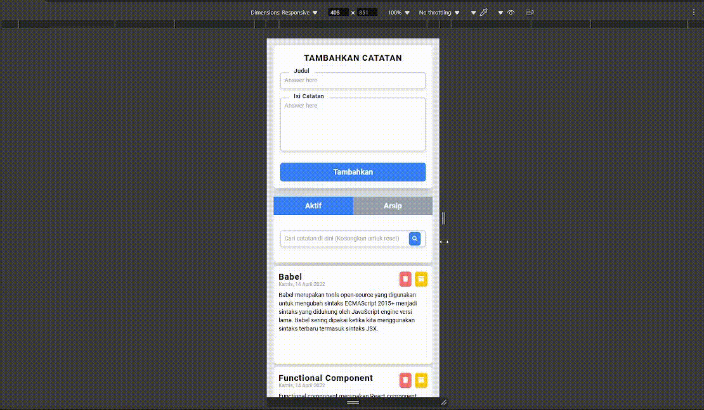
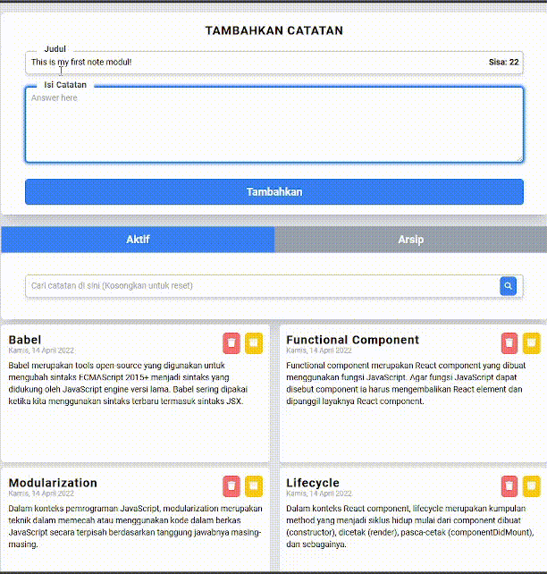
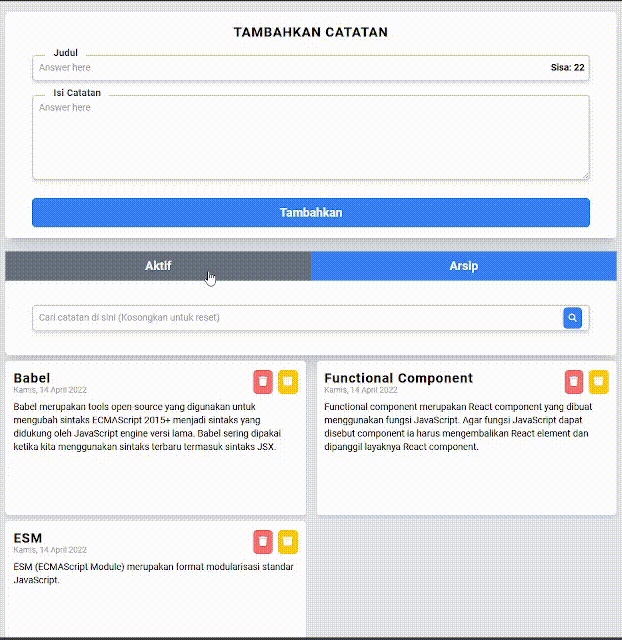
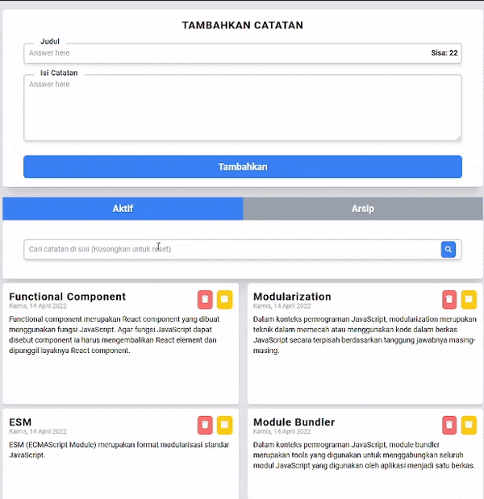
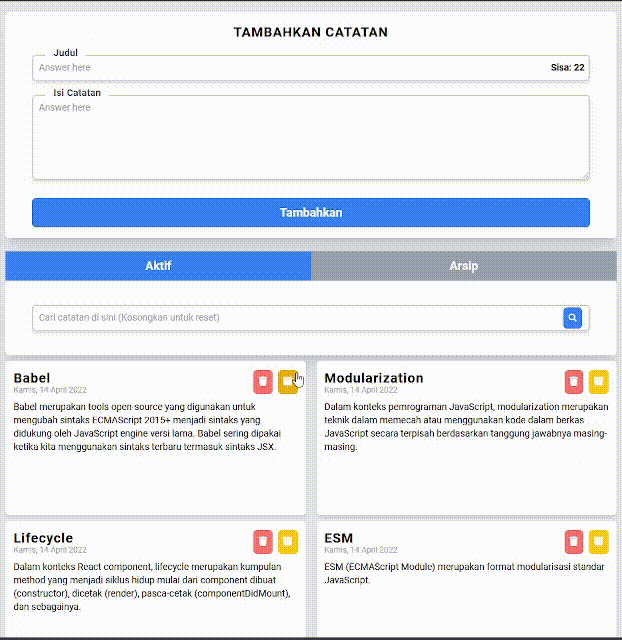
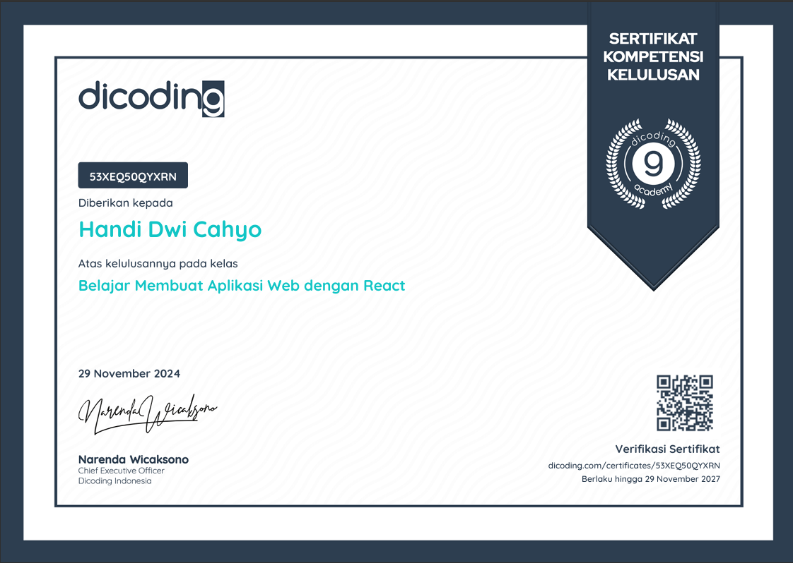

<div align='center'>
  

  <h3>Simple React Note</h3>
  <p>A simple note apps using ReactJS meant to be a submission for Dicoding's submission class "Belajar Membuat Aplikasi Web dengan React".</p>
</div>

<details>
  <summary>Table of Contents</summary>
  <ol>
    <li><a href='#about-project'>About Project</a></li>
    <li><a href='#installation'>Installation</a></li>
    <li><a href='#how-to-use'>How to Use</a></li>
  </ol>
</details>

## About Project
The **Simple React Note** project is a lightweight note-taking application built using ReactJS as part of Dicoding's class submission, **"Belajar Membuat Aplikasi Web dengan React"**.

<div align="center">
   
</div>

Features:
1. Add Notes: Create new notes with a title and content.
2. Delete Notes: Remove unwanted notes easily.
3. Archive Notes: Move notes between active and archived lists.
4. Responsive Design: Responsive for both desktop and mobile usage.
5. Search Notes: Search note by the title.

This project showcases fundamental ReactJS concepts, including:

- Component-based architecture
- State management using React hooks
- Styling and responsive design using CSS

The application aims to demonstrate core skills in modern web development using ReactJS.

## Installation

Follow these steps to set up and run the project locally:

### Prerequisites
Make sure you have the following installed:
- **Node.js** (v16 or newer)
- **Package Manager**: `npm` (comes with Node.js) or `pnpm` (install it globally with `npm install -g pnpm`)

### Steps
1. Clone the repository to your local machine:
```bash
git clone https://github.com/wistchze/rj_note.git
cd simple-react-note
```
2. Install dependencies
```bash
pnpm install # Or npm install
```

3. Start the development server
```bash
pnpm run dev # or npm
```
4. Open your browser and go to http://localhost:5173

## How to Use

Follow these steps to start using the **Simple React Note** app:

1. **Add a Note**
   - Fill in the "Judul" (Title) and "Isi Catatan" (Note Content) fields in the input area at the top of the page.
   - Click the **"Tambahkan"** (Add) button to save the note. Your note will appear in the "Aktif" (Active) section below.

<div align="center">
   
</div>

2. **Delete Notes**
   - To permanently delete a note, click the **red delete button** (trash can icon) on the note.

<div align="center">
   
</div>

3. **Search Notes**
   - Use the search bar under the tabs to filter notes based on keywords in the title or content.
   - Clear the search field to reset the results.
  
<div align="center">
   
</div>

4. **Switch Between Active and Archived Notes**
   - All added notes are displayed in the "Aktif" (Active) tab.
   - To move a note to the archive, click the **yellow archive button** (box icon with an arrow) on the note.
   - Archived notes can be accessed from the "Arsip" (Archive) tab.
   - Use the "Aktif" and "Arsip" tabs to toggle between active and archived notes.
<div align="center">
   
</div>

Enjoy a simple and organized way to manage your notes!

## Certificate
<div align="center">
   
   
</div>

[Certificate (PDF)](docs/certificate-react-note.pdf)

The certification will valid until 29 November 2027. The submission score is give stars.

